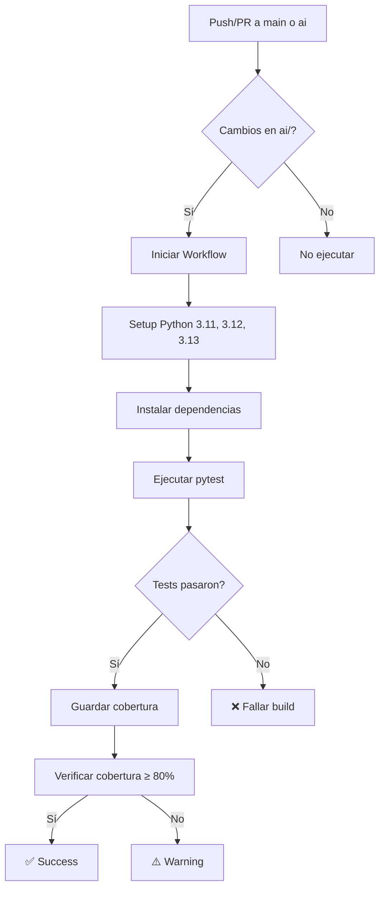

# 🎯 GitHub Actions Workflow - Resumen de Implementación

## ✅ Archivos Creados

### 1. **Workflow Principal**
📄 `.github/workflows/ai-backend-tests.yml`
- ✅ Tests automáticos en 3 versiones de Python (3.11, 3.12, 3.13)
- ✅ Cobertura de código con pytest
- ✅ Verificación de cobertura mínima (80%)
- ✅ Guardado de reportes como artefactos

### 2. **Documentación**
📄 `.github/workflows/README_AI_TESTS.md`
- Guía completa de uso del workflow
- Instrucciones de troubleshooting
- Comandos locales equivalentes
- Configuración adicional (Codecov, SonarCloud)

### 3. **README Principal**
📄 `README.md`
- ✅ Badges de estado de workflows
- ✅ Estructura del proyecto
- ✅ Instrucciones de instalación
- ✅ Enlaces a documentación

### 4. **Pre-commit Hooks** (Opcional)
📄 `.pre-commit-config.yaml.example`
- Configuración de ejemplo para hooks locales
- Black, isort, flake8
- Ejecución automática de tests antes de push

## 🚀 Cómo Funciona

### Triggers (Cuándo se ejecuta)
```yaml
on:
  push:
    branches: [ "main", "ai" ]
    paths: [ 'ai/**' ]
  pull_request:
    branches: [ "main", "ai" ]
    paths: [ 'ai/**' ]
```

**Se ejecuta cuando:**
- ✅ Haces push a `main` o `ai`
- ✅ Creas un Pull Request hacia `main` o `ai`
- ✅ Solo si hay cambios en la carpeta `ai/`

### Jobs

#### **1. Test** (Paralelo en 3 versiones)
```
Python 3.11 ─┐
Python 3.12 ─┼─→ Tests + Cobertura
Python 3.13 ─┘    ↓
              Artefacto (coverage.xml)
```

#### **2. Coverage Check** (Depende de Test)
```
Test exitoso → Verificar cobertura ≥ 80%
```

## 📊 Visualización

### En GitHub
1. Ve a: `https://github.com/IbaiZJ/CRAI/actions`
2. Selecciona "AI Backend Tests"
3. Verás:
   - ✅ Estado de cada versión de Python
   - ⏱️ Tiempo de ejecución
   - 📊 Logs detallados
   - 📦 Artefactos descargables

### Badges en README
```markdown
[](https://github.com/IbaiZJ/CRAI/actions/workflows/ai-backend-tests.yml)
```

Resultado: 

## 🔧 Comandos Útiles

### Probar localmente antes de push
```bash
cd ai

# Instalar dependencias
pip install -r requirements.txt

# Ejecutar tests (igual que CI)
pytest -v --cov=api --cov-report=xml --cov-report=term-missing

# Verificar cobertura mínima
pytest --cov=api --cov-fail-under=80
```

### Validar sintaxis del workflow
```bash
# Usar act (herramienta para ejecutar workflows localmente)
# https://github.com/nektos/act
act -l  # Listar jobs
act push  # Simular push
```

## 🎨 Optimizaciones Implementadas

1. **Cache de pip** 🚀
   - Las dependencias se cachean entre ejecuciones
   - Reduce tiempo de ~30s a ~5s

2. **Matriz de Python** 🔢
   - Tests en paralelo = más rápido
   - Compatibilidad verificada en múltiples versiones

3. **Paths filter** 🎯
   - Solo ejecuta si hay cambios en `ai/`
   - Ahorra minutos de GitHub Actions

4. **fail-fast: false** 💪
   - Continúa tests aunque una versión falle
   - Ver todos los resultados de una vez

5. **Artefactos** 📦
   - Reportes guardados por 30 días
   - Descargables desde la UI de GitHub

## 📈 Estadísticas Esperadas

### Primera Ejecución
```
⏱️ Tiempo: ~2-3 minutos
├── Setup Python: ~30s
├── Install deps: ~30s (sin cache)
└── Run tests: ~1s por versión
```

### Ejecuciones Posteriores (con cache)
```
⏱️ Tiempo: ~1-1.5 minutos
├── Setup Python: ~5s
├── Install deps: ~5s (con cache)
└── Run tests: ~1s por versión
```

### Coste (GitHub Actions)
- **Gratis** para repositorios públicos
- **2000 minutos/mes** gratis para privados
- Este workflow usa ~3 minutos por ejecución

## 🛡️ Protecciones Recomendadas

### Branch Protection Rules
En GitHub → Settings → Branches → Add rule:

```yaml
Branch name pattern: main
☑️ Require status checks to pass before merging
  ☑️ AI Backend Tests / Test Python 3.13
  ☑️ AI Backend Tests / Coverage Check
☑️ Require branches to be up to date before merging
```

Esto **bloquea merges** si los tests fallan.

## 🔄 Flujo Completo



## 🎓 Próximos Pasos

### 1. Activar el Workflow
```bash
# Hacer commit de los cambios
git add .github/workflows/ai-backend-tests.yml
git add README.md
git commit -m "feat: add GitHub Actions workflow for AI tests"
git push origin ai
```

### 2. Verificar Ejecución
- Ve a GitHub Actions
- Verifica que el workflow se ejecute
- Revisa los logs

### 3. Agregar Badge al README
Ya está agregado en el README.md actualizado

### 4. (Opcional) Configurar Pre-commit
```bash
# Renombrar archivo de ejemplo
mv .pre-commit-config.yaml.example .pre-commit-config.yaml

# Instalar
pip install pre-commit
pre-commit install

# Probar
pre-commit run --all-files
```

### 5. (Opcional) Integrar con Codecov
```bash
# 1. Crear cuenta en codecov.io
# 2. Agregar repositorio
# 3. Copiar token
# 4. GitHub → Settings → Secrets → New secret
#    Name: CODECOV_TOKEN
#    Value: <tu-token>
```

Luego agregar al workflow:
```yaml
- name: Upload to Codecov
  uses: codecov/codecov-action@v4
  with:
    file: ./ai/coverage.xml
    token: ${{ secrets.CODECOV_TOKEN }}
```

## 🎉 Resultado Final

### Estado Actual
- ✅ 17 tests
- ✅ 100% cobertura
- ✅ 3 versiones de Python
- ✅ CI/CD automático
- ✅ Reportes guardados
- ✅ Badges en README

### Beneficios
1. **Confianza**: Tests automáticos antes de merge
2. **Calidad**: Cobertura verificada
3. **Compatibilidad**: Múltiples versiones de Python
4. **Visibilidad**: Badges y reportes
5. **Productividad**: Detección temprana de bugs

---

¡El workflow está listo para usar! 🚀
